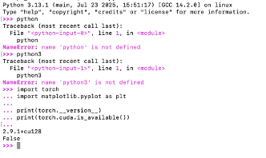
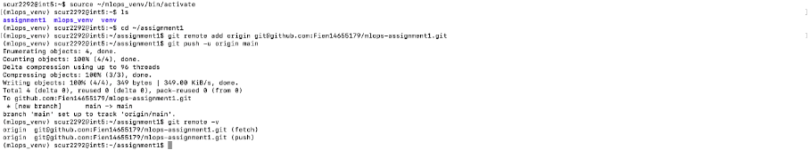
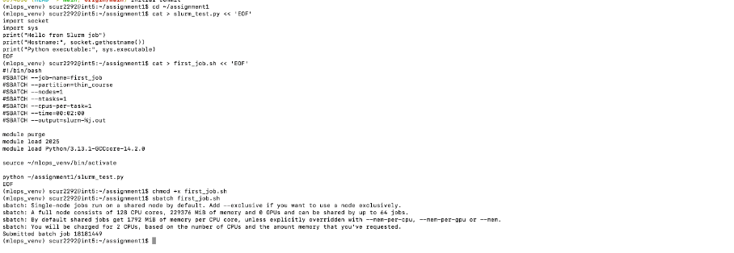
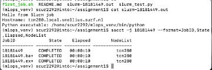

## Question 1 — First Contact with Snellius (Cluster Access)

### (a) SSH-verbinding en login node

Ik heb verbinding gemaakt met Snellius met het volgende commando:

```bash
ssh scur2292@snellius.surf.nl
```
Na het inloggen kwam ik terecht op login node int5, wat zichtbaar was in de shell prompt.
\
)

###  (b) Problemen en onduidelijkheden tijdens het verbinden

Toen ik voor het eerst probeerde in te loggen, lukte de SSH-handshake wel, maar werd de verbinding direct daarna weer gesloten. Dit gebeurde vlak nadat ik mijn SURF-wachtwoord had ingesteld.

Het gedrag dat ik zag was dat de server bereikbaar was, maar dat de loginsessie meteen werd beëindigd zonder een duidelijke foutmelding zoals "wrong password". Dit was verwarrend, omdat het leek alsof mijn SSH-configuratie fout was.

Uiteindelijk bleek dat mijn SURF-account nog niet volledig geactiveerd was in alle systemen. Nadat ik een tijdje had gewacht en het de volgende dag opnieuw probeerde, werkte de SSH-verbinding wel direct. Daarmee was duidelijk dat het probleem niet bij mijn instellingen lag, maar bij de account-propagatie aan de kant van SURF.

### (c) SSH-client, ervaring en voorzorgsmaatregelen

Ik heb de standaard OpenSSH-client gebruikt om verbinding te maken met Snellius.

Ik had vóór deze opdracht slechts beperkte ervaring met SSH (voornamelijk simpele ssh user@host commando’s). Daarom heb ik bewust eerst geprobeerd om met alleen een wachtwoord in te loggen, voordat ik met SSH-sleutels begon.

Om veelgemaakte fouten te vermijden heb ik:

De officiële hostnaam snellius.surf.nl gebruikt

Gecontroleerd dat ik mijn juiste SURF-gebruikersnaam scur2292 gebruikte

Eerst getest of inloggen met wachtwoord werkte voordat ik verder ging met key-based login

Hierdoor kon ik goed onderscheiden of problemen werden veroorzaakt door accountactivatie of door een fout in mijn SSH-configuratie.

## Question 2 — Environment Setup (Modules & Virtual Environments)

### (1) Modules laden en virtuele omgeving aanmaken

Op Snellius wordt software beheerd via het module-systeem. Daarom heb ik eerst de juiste module stack geladen en daarna een Python-omgeving opgezet met een virtuele omgeving (venv).

De exacte volgorde van commando’s die ik heb gebruikt was:

```bash
module load 2025
module load Python/3.13.1-GCCcore-14.2.0
module load matplotlib/3.10.3-gfbf-2025a

python -m venv mlops_venv
source mlops_venv/bin/activate

De volledige locatie van mijn virtuele omgeving is:

/gpfs/home6/scur2292/mlops_venv 
```
### (2) Installatie van PyTorch

Binnen de virtuele omgeving heb ik PyTorch met CUDA-ondersteuning geïnstalleerd met:

pip install torch torchvision torchaudio --index-url https://download.pytorch.org/whl/cu121


Tijdens de eerste poging leek pip vast te lopen. Dit bleek te komen doordat ik niet meer in een normale bash-shell zat (waarschijnlijk vast in een subprocess of pager).
Na Ctrl+C kreeg ik mijn shell terug en kon de installatie normaal worden afgerond.

Daarna kreeg ik nog een fout bij het importeren van Matplotlib, omdat de module packaging ontbrak. Dit heb ik opgelost met:

pip install packaging


Na deze installatie konden zowel PyTorch als Matplotlib zonder fouten worden geïmporteerd.


### (3)) Verificatie van de installatie

Om te controleren of PyTorch correct was geïnstalleerd en of CUDA beschikbaar was, heb ik het volgende commando uitgevoerd:

python -c "import torch; print(f'PyTorch: {torch.__version__}'); print(f'CUDA available: {torch.cuda.is_available()}')"


De uitvoer liet een +cu suffix in de PyTorch-versie zien, wat betekent dat PyTorch met CUDA-ondersteuning is geïnstalleerd.
De waarde False voor torch.cuda.is_available() is verwacht, omdat dit commando op een login node is uitgevoerd, waar geen GPU’s beschikbaar zijn. GPU-toegang is alleen mogelijk op compute nodes via Slurm.

 ### (4) Problemen en hoe ik ze heb opgelost

Het belangrijkste probleem dat ik tegenkwam was dat sommige Python-modules die Matplotlib nodig had (zoals packaging) niet automatisch werden meegeïnstalleerd. Hierdoor faalde de import in eerste instantie. Door de foutmelding te lezen en de ontbrekende dependency apart te installeren, kon ik dit oplossen.

Daarnaast zorgde het feit dat ik tijdelijk niet meer in een normale shell zat ervoor dat pip leek vast te lopen. Door de installatie af te breken met Ctrl+C en opnieuw te starten in de actieve venv, kon ik de installatie correct afronden.

Na deze stappen werkte mijn Python-omgeving zoals bedoeld: zowel PyTorch als Matplotlib konden zonder fouten worden gebruikt binnen mijn virtuele omgeving.

\!

## Question 3 — Version Control Setup (Git & GitHub)

### (1) GitHub repository

Mijn GitHub-repository voor deze opdracht is:

**https://github.com/Fien14655179/mlops-assignment1**

---

### (2) Authenticatiemethode en fouten bij de eerste `git push`

Ik heb GitHub verbonden met Snellius via **SSH-key authenticatie**. De remote URL begon met:

git@github.com:Fien14655179/mlops-assignment1.git

bash
Code kopiëren

Na het aanmaken van een SSH-sleutel op Snellius met:

```bash
ssh-keygen -t ed25519
cat ~/.ssh/id_ed25519.pub
```
heb ik de public key toegevoegd aan GitHub onder Settings → SSH and GPG keys.

Bij de eerste verbinding met GitHub kreeg ik de volgende melding:
```bash
vbnet
Code kopiëren
The authenticity of host 'github.com' can't be established.
ED25519 key fingerprint is SHA256:...
Are you sure you want to continue connecting (yes/no/[fingerprint])?
```

Na het beantwoorden met yes werd GitHub toegevoegd aan mijn known_hosts:
``` bash
vbnet
Code kopiëren
Warning: Permanently added 'github.com' (ED25519) to the list of known hosts.
Hi Fien14655179! You've successfully authenticated, but GitHub does not provide shell access.
Daarna kon ik zonder problemen naar GitHub pushen.
```

\!
### (3) .gitignore en uitleg
De inhoud van mijn .gitignore bestand is:
``` bash
venv/
mlops_venv/
__pycache__/
*.pyc
.pytest_cache/
.DS_Store

```
Belangrijke dingen om op te nemen in een .gitignore zijn:

Virtuele omgevingen (venv/, mlops_venv/), omdat deze lokaal en systeem-specifiek zijn

Python-cachebestanden (__pycache__/, *.pyc, .pytest_cache/)

OS- en editor-specifieke bestanden (zoals .DS_Store)

Dit voorkomt dat onnodige of irreproduceerbare bestanden in de repository terechtkomen en houdt het project overzichtelijk en reproduceerbaar.

Moet informatie over Snellius in de README.md staan?
Ja, in beknopte vorm. Een README is bedoeld als “quickstart” voor jezelf en anderen. Het is daarom nuttig om minimaal te documenteren:

- hoe je op Snellius inlogt

- welke modules geladen moeten worden

- hoe je de venv activeert

- hoe je tests draait

Dit verhoogt de reproduceerbaarheid van het project.

### (4) git log --oneline
De output van:

```bash 
git log --oneline
is:

sql

16ee946 grote commit
b14495a Reinitialize from SURF template + restore PCAM data pipeline and EDA
880d065 Merge pull request #2 from SURF-ML/example_script
d2187cb example lecture 2 week 1
81e4e92 Merge pull request #1 from SURF-ML/fix_tests_for_students
```
Deze commits zijn zichtbaar in mijn GitHub-repository en tonen zowel mijn eigen werk als de updates vanuit het SURF-ML skeleton-project.

Misschien nu niet, omdat ik opnieuw de github repository heb gecloned, maar in de geschiedenis is alles te zien. 


## Question 4 — Your First Batch Job (Slurm)

### (1) Bestanden + bewijs (job script, python script, output)

Voor mijn eerste batch job heb ik een simpel Slurm-script geschreven dat een Python-script uitvoert op een compute node.

- **Slurm job script:** `first_job.sh`  
- **Python script:** `slurm_test.py`  
- **Output bestand:** `slurm-18181449.out`


\!
---

### (2) Job ID + wachttijd in queue

Ik heb de job ingediend met:

```bash
sbatch first_job.sh
De Job ID die Slurm terug gaf was:

Job ID: 18181449
```
Om te controleren wanneer de job startte en klaar was, heb ik sacct gebruikt:
```bash
bash
sacct -j 18181449 --format=JobID,Start,End,Elapsed,State
```
Hieruit bleek dat de job succesvol is afgerond met status COMPLETED en ongeveer 10 seconden heeft gedraaid.

(Volgens sacct/output draaide de job op node tcn280.)

\!

### (3) Probleem tijdens job submission (debugging)
In het begin maakte ik een fout doordat ik placeholder-tekst zoals <JOBID> letterlijk probeerde te gebruiken in commando’s, waardoor ik “command not found”/verkeerde bestandsnamen kreeg. Ik had bijvoorbeeld nog niet het echte jobnummer vervangen door het jobnummer dat sbatch teruggeeft.

Toen ik het echte Job ID (18181449) gebruikte en in de juiste map naar de outputbestanden keek, kon ik de .out en .err bestanden wel vinden en lezen. Daarna kon ik de job correct monitoren.


### (4) Verifiëren dat de job succesvol draaide
Ik heb de job gemonitord met Slurm-tools en gecontroleerd via de outputfile.
De output liet zien dat het script niet op een login node draaide, maar op een compute node (tcn280), en dat mijn (virtuele) Python environment gebruikt werd.
\!

### (5) Login node vs batch job
Een Python script direct uitvoeren op een login node is bedoeld voor lichte taken zoals:

- files editen

- korte tests

- jobs submitten

Een batch job via Slurm draait op een compute node met gereserveerde resources (CPU/GPU/memory). Dit is de juiste manier voor zwaardere computation en voorkomt dat je de login nodes belast.

### (6) Waarom een cluster gebruiken?
Een cluster is nuttig omdat:

je computation schaalbaar is (meerdere nodes/GPUs)

resources eerlijk verdeeld worden via een scheduler (Slurm)

je jobs reproduceerbaar zijn (zelfde script + configs + logs)

je zware ML-training niet op je laptop of login node hoeft te draaien

markdown
Code kopiëren
