## Question 1 — First Contact with Snellius (Cluster Access)

### (1) SSH-verbinding en login node

Ik heb verbinding gemaakt met Snellius met het volgende commando:

```bash
ssh scur2292@snellius.surf.nl
```
Na het inloggen kwam ik terecht op login node int5, wat zichtbaar was in de shell prompt.
\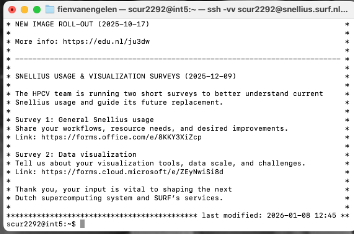


###  (2) Problemen en onduidelijkheden tijdens het verbinden

Toen ik voor het eerst probeerde in te loggen, lukte de SSH-handshake wel, maar werd de verbinding direct daarna weer gesloten. Dit gebeurde vlak nadat ik mijn SURF-wachtwoord had ingesteld.

Het gedrag dat ik zag was dat de server bereikbaar was, maar dat de loginsessie meteen werd beëindigd zonder een duidelijke foutmelding zoals "wrong password". Dit was verwarrend, omdat het leek alsof mijn SSH-configuratie fout was.

Uiteindelijk bleek dat mijn SURF-account nog niet volledig geactiveerd was in alle systemen. Nadat ik een tijdje had gewacht en het de volgende dag opnieuw probeerde, werkte de SSH-verbinding wel direct. Daarmee was duidelijk dat het probleem niet bij mijn instellingen lag, maar bij de account-propagatie aan de kant van SURF.

\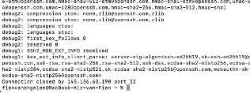

### (3) SSH-client, ervaring en voorzorgsmaatregelen

Ik heb de standaard OpenSSH-client gebruikt om verbinding te maken met Snellius.

Ik had vóór deze opdracht slechts beperkte ervaring met SSH (voornamelijk simpele ssh user@host commando’s). Daarom heb ik bewust eerst geprobeerd om met alleen een wachtwoord in te loggen, voordat ik met SSH-sleutels begon.

Om veelgemaakte fouten te vermijden heb ik:

De officiële hostnaam snellius.surf.nl gebruikt

Gecontroleerd dat ik mijn juiste SURF-gebruikersnaam scur2292 gebruikte

Eerst getest of inloggen met wachtwoord werkte voordat ik verder ging met key-based login

Hierdoor kon ik goed onderscheiden of problemen werden veroorzaakt door accountactivatie of door een fout in mijn SSH-configuratie.

## Question 2 — Environment Setup (Modules & Virtual Environments)

### (1) Modules laden en virtuele omgeving aanmaken

Op Snellius wordt software beheerd via het module-systeem. Daarom heb ik eerst de juiste module stack geladen en daarna een Python-omgeving opgezet met een virtuele omgeving (venv).

De exacte volgorde van commando’s die ik heb gebruikt was:

```bash
module load 2025
module load Python/3.13.1-GCCcore-14.2.0
module load matplotlib/3.10.3-gfbf-2025a

python -m venv mlops_venv
source mlops_venv/bin/activate

De volledige locatie van mijn virtuele omgeving is:

/gpfs/home6/scur2292/mlops_venv 
```
### (2) Installatie van PyTorch

Binnen de virtuele omgeving heb ik PyTorch met CUDA-ondersteuning geïnstalleerd met:

pip install torch torchvision torchaudio --index-url https://download.pytorch.org/whl/cu121


Tijdens de eerste poging leek pip vast te lopen. Dit bleek te komen doordat ik niet meer in een normale bash-shell zat (waarschijnlijk vast in een subprocess of pager).
Na Ctrl+C kreeg ik mijn shell terug en kon de installatie normaal worden afgerond.

Daarna kreeg ik nog een fout bij het importeren van Matplotlib, omdat de module packaging ontbrak. Dit heb ik opgelost met:

pip install packaging


Na deze installatie konden zowel PyTorch als Matplotlib zonder fouten worden geïmporteerd.


### (3)) Verificatie van de installatie

Om te controleren of PyTorch correct was geïnstalleerd en of CUDA beschikbaar was, heb ik het volgende commando uitgevoerd:

python -c "import torch; print(f'PyTorch: {torch.__version__}'); print(f'CUDA available: {torch.cuda.is_available()}')"


De uitvoer liet een +cu suffix in de PyTorch-versie zien, wat betekent dat PyTorch met CUDA-ondersteuning is geïnstalleerd.
De waarde False voor torch.cuda.is_available() is verwacht, omdat dit commando op een login node is uitgevoerd, waar geen GPU’s beschikbaar zijn. GPU-toegang is alleen mogelijk op compute nodes via Slurm.

 ### (4) Problemen en hoe ik ze heb opgelost

Het belangrijkste probleem dat ik tegenkwam was dat sommige Python-modules die Matplotlib nodig had (zoals packaging) niet automatisch werden meegeïnstalleerd. Hierdoor faalde de import in eerste instantie. Door de foutmelding te lezen en de ontbrekende dependency apart te installeren, kon ik dit oplossen.

Daarnaast zorgde het feit dat ik tijdelijk niet meer in een normale shell zat ervoor dat pip leek vast te lopen. Door de installatie af te breken met Ctrl+C en opnieuw te starten in de actieve venv, kon ik de installatie correct afronden.

Na deze stappen werkte mijn Python-omgeving zoals bedoeld: zowel PyTorch als Matplotlib konden zonder fouten worden gebruikt binnen mijn virtuele omgeving.

\!

## Question 3 — Version Control Setup (Git & GitHub)

### (1) GitHub repository

Mijn GitHub-repository voor deze opdracht is:

**https://github.com/Fien14655179/mlops-assignment1**

---

### (2) Authenticatiemethode en fouten bij de eerste `git push`

Ik heb GitHub verbonden met Snellius via **SSH-key authenticatie**. De remote URL begon met:

git@github.com:Fien14655179/mlops-assignment1.git

bash
Code kopiëren

Na het aanmaken van een SSH-sleutel op Snellius met:

```bash
ssh-keygen -t ed25519
cat ~/.ssh/id_ed25519.pub
```
heb ik de public key toegevoegd aan GitHub onder Settings → SSH and GPG keys.

Bij de eerste verbinding met GitHub kreeg ik de volgende melding:
```bash
vbnet
Code kopiëren
The authenticity of host 'github.com' can't be established.
ED25519 key fingerprint is SHA256:...
Are you sure you want to continue connecting (yes/no/[fingerprint])?
```

Na het beantwoorden met yes werd GitHub toegevoegd aan mijn known_hosts:
``` bash
vbnet
Code kopiëren
Warning: Permanently added 'github.com' (ED25519) to the list of known hosts.
Hi Fien14655179! You've successfully authenticated, but GitHub does not provide shell access.
Daarna kon ik zonder problemen naar GitHub pushen.
```

\!
### (3) .gitignore en uitleg
De inhoud van mijn .gitignore bestand is:
``` bash
venv/
mlops_venv/
__pycache__/
*.pyc
.pytest_cache/
.DS_Store

```
Belangrijke dingen om op te nemen in een .gitignore zijn:

Virtuele omgevingen (venv/, mlops_venv/), omdat deze lokaal en systeem-specifiek zijn

Python-cachebestanden (__pycache__/, *.pyc, .pytest_cache/)

OS- en editor-specifieke bestanden (zoals .DS_Store)

Dit voorkomt dat onnodige of irreproduceerbare bestanden in de repository terechtkomen en houdt het project overzichtelijk en reproduceerbaar.

Moet informatie over Snellius in de README.md staan?
Ja, in beknopte vorm. Een README is bedoeld als “quickstart” voor jezelf en anderen. Het is daarom nuttig om minimaal te documenteren:

- hoe je op Snellius inlogt

- welke modules geladen moeten worden

- hoe je de venv activeert

- hoe je tests draait

Dit verhoogt de reproduceerbaarheid van het project.

### (4) git log --oneline
De output van:

```bash 
git log --oneline
is:

sql

16ee946 grote commit
b14495a Reinitialize from SURF template + restore PCAM data pipeline and EDA
880d065 Merge pull request #2 from SURF-ML/example_script
d2187cb example lecture 2 week 1
81e4e92 Merge pull request #1 from SURF-ML/fix_tests_for_students
```
Deze commits zijn zichtbaar in mijn GitHub-repository en tonen zowel mijn eigen werk als de updates vanuit het SURF-ML skeleton-project.

Misschien nu niet, omdat ik opnieuw de github repository heb gecloned, maar in de geschiedenis is alles te zien. 


## Question 4 — Your First Batch Job (Slurm)

### (1) Bestanden + bewijs (job script, python script, output)

Voor mijn eerste batch job heb ik een simpel Slurm-script geschreven dat een Python-script uitvoert op een compute node.

- **Slurm job script:** `first_job.sh`  
- **Python script:** `slurm_test.py`  
- **Output bestand:** `slurm-18181449.out`

alles is te zien in de screenshot hoe het is geschreven.

\!
---

### (2) Job ID + wachttijd in queue

Ik heb de job ingediend met:

```bash
sbatch first_job.sh
De Job ID die Slurm terug gaf was:

Job ID: 18181449
```
Om te controleren wanneer de job startte en klaar was, heb ik sacct gebruikt:
```bash
bash
sacct -j 18181449 --format=JobID,Start,End,Elapsed,State
```
Hieruit bleek dat de job succesvol is afgerond met status COMPLETED en ongeveer 10 seconden heeft gedraaid.

(Volgens sacct/output draaide de job op node tcn280.)

\!

### (3) Probleem tijdens job submission (debugging)
In het begin maakte ik een fout doordat ik placeholder-tekst zoals <JOBID> letterlijk probeerde te gebruiken in commando’s, waardoor ik “command not found”/verkeerde bestandsnamen kreeg. Ik had bijvoorbeeld nog niet het echte jobnummer vervangen door het jobnummer dat sbatch teruggeeft.

Toen ik het echte Job ID (18181449) gebruikte en in de juiste map naar de outputbestanden keek, kon ik de .out en .err bestanden wel vinden en lezen. Daarna kon ik de job correct monitoren.
Dit is te zien in het begin.
\!

### (4) Verifiëren dat de job succesvol draaide
Ik heb de job gemonitord met Slurm-tools en gecontroleerd via de outputfile.
De output liet zien dat het script niet op een login node draaide, maar op een compute node (tcn280), en dat mijn (virtuele) Python environment gebruikt werd.
\!

### (5) Login node vs batch job
Een Python script direct uitvoeren op een login node is bedoeld voor lichte taken zoals:

- files editen

- korte tests

- jobs submitten

Een batch job via Slurm draait op een compute node met gereserveerde resources (CPU/GPU/memory). Dit is de juiste manier voor zwaardere computation en voorkomt dat je de login nodes belast.

### (6) Waarom een cluster gebruiken?
Een cluster is nuttig omdat:

je computation schaalbaar is (meerdere nodes/GPUs)

resources eerlijk verdeeld worden via een scheduler (Slurm)

je jobs reproduceerbaar zijn (zelfde script + configs + logs)

je zware ML-training niet op je laptop of login node hoeft te draaien

markdown
Code kopiëren

## Question 5 — Reflection on Data, Reproducibility and Environments

### (a) Waarom zijn veel kleine bestanden problematisch op een cluster?

Een cluster zoals Snellius gebruikt een gedeeld filesysteem (GPFS) dat geoptimaliseerd is voor grote, sequentiële datatoegang. Wanneer een dataset uit honderdduizenden kleine bestanden bestaat, moet het filesysteem voor elk bestand metadata ophalen (zoals inode-informatie). Dit veroorzaakt extreem veel overhead, waardoor I/O veel trager wordt, ook al is de totale hoeveelheid data klein.

Daarom worden grote datasets op HPC-systemen meestal opgeslagen in samengevoegde formaten zoals HDF5, LMDB of tar-archieven, zodat het aantal bestandstoegangen minimaal blijft.

---

### (b) Hoe versieer je grote datasets?

Grote datasets worden niet in Git opgeslagen, omdat Git niet geschikt is voor grote binaire bestanden. In plaats daarvan worden datasets geversioneerd via:
- checksums of hashes (bijvoorbeeld SHA256)
- manifest-bestanden die beschrijven welke bestanden bij een datasetversie horen
- externe opslag (zoals object stores of shared scratch storage)
- tools zoals DVC (Data Version Control)

Op deze manier kan exact worden vastgelegd welke versie van een dataset gebruikt is bij een experiment, zonder de data zelf in Git op te slaan.

---

### (c) Waarom kunnen twee ML-experimenten met dezelfde code toch andere resultaten geven?

Zelfs met identieke code kunnen resultaten verschillen door:
- willekeurige initialisatie van neurale netwerken
- random shuffling van data
- verschillen in PyTorch- of CUDA-versies
- verschillen in hardware (bijvoorbeeld GPU type)

Zonder vaste random seeds en vaste softwareversies zijn ML-experimenten dus niet volledig reproduceerbaar. Daarom is het belangrijk om zowel code, configuraties als de exacte omgeving vast te leggen.

---

### (d) Waarom wordt Conda afgeraden op Snellius?

Conda beheert niet alleen Python-pakketten, maar ook systeemlibraries (zoals C, CUDA, BLAS). Dit botst vaak met de door Snellius geleverde modules, die al geoptimaliseerde versies van deze libraries bevatten.

Het gebruik van Conda kan daardoor leiden tot:
- conflicten tussen Conda-libraries en module-libraries
- onverwacht gedrag of crashes
- slechtere performance

Daarom is het veiliger om op Snellius de **module stack** te gebruiken in combinatie met een lichte Python-omgeving zoals `venv` of `uv`.

## Question 6 — Python Package Structure and Imports

### (a) Installatie van het skeleton package

Na het klonen van het skeleton repository heb ik het project lokaal geïnstalleerd als een Python-package met:

```bash
pip install -e .
```
Hiermee wordt het project in “editable mode” geïnstalleerd. Dat betekent dat wijzigingen in de broncode direct effect hebben zonder dat het package opnieuw geïnstalleerd hoeft te worden. Dit is belangrijk tijdens ontwikkeling en debugging.

### (b) Waarom ml_core als package wordt gebruikt

De code in dit project staat in de map:
``` bash
src/ml_core/

```
Door deze map als package te installeren, kan ik overal in het project imports doen zoals:
``` bash
from ml_core.data.loader import get_dataloaders
from ml_core.models.mlp import MLP

```
In plaats van relatieve of pad-gebaseerde imports zoals ../../models/mlp.py.
Dit maakt de code:

- duidelijker

- minder foutgevoelig

- beter geschikt voor grotere projecten

### (c) Testen van de package-structuur

Om te controleren of de package-structuur correct was opgezet, heb ik de volgende test gedraaid:
``` bash 
pytest tests/test_imports.py
```

Deze test controleert of alle belangrijke modules binnen ml_core correct geïmporteerd kunnen worden. In het begin faalde deze test omdat Python het ml_core package niet kon vinden. Nadat ik het project had geïnstalleerd met pip install -e ., werkte de import correct en slaagde de test.

### (d) Waarom dit belangrijk is voor MLOps

Een correcte package-structuur zorgt ervoor dat:

code reproduceerbaar is

scripts zowel lokaal als op het cluster hetzelfde werken

CI-systemen (zoals GitHub Actions) dezelfde imports kunnen gebruiken als op Snellius

Zonder een goede package-structuur zouden scripts alleen werken in specifieke mappen, wat niet schaalbaar is voor grotere ML-projecten.

## Question 7 — The Data Pipeline (PyTorch & PCAM)

### (1) Implementatie van `PCAMDataset` (`__getitem__`)

De PCAM-dataset is opgeslagen in HDF5-bestanden. Om geheugenverbruik laag te houden gebruik ik **lazy loading**: de HDF5-files worden pas geopend bij de eerste toegang en niet volledig in het geheugen geladen.

In mijn `__getitem__` gebeurt het volgende:
- Het beeld wordt uit HDF5 gelezen als numpy-array
- De waarden worden geconverteerd naar `float32`
- Numerieke clipping wordt toegepast (`np.clip(x, 0, 255)`) om corrupte waarden te verwijderen
- De waarden worden genormaliseerd naar `[0,1]`
- De dimensies worden omgezet van **HWC → CHW**
- Het beeld wordt omgezet naar een `torch.float32` tensor
- Het label wordt een `torch.long` scalar

Daarnaast gebruik ik **index-mapping** via `self.indices`, zodat na heuristische filtering de juiste HDF5-indices behouden blijven.
\!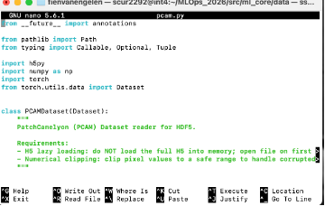
gebruikte code:
```python
from __future__ import annotations

from pathlib import Path
from typing import Callable, Optional, Tuple

import h5py
import numpy as np
import torch
from torch.utils.data import Dataset


class PCAMDataset(Dataset):
    """
    PatchCamelyon (PCAM) Dataset reader for HDF5.

    Requirements:
    - H5 lazy loading: do NOT load the full H5 into memory; open file on first access.
    - Numerical clipping: clip pixel values to a safe range to handle corrupted samples.
    """

    def __init__(
        self,
        x_path: str | Path,
        y_path: str | Path,
        transform: Optional[Callable] = None,
        clip_min: float = 0.0,
        clip_max: float = 255.0,
        scale_to_01: bool = True,
    ) -> None:
        self.x_path = Path(x_path)
        self.y_path = Path(y_path)
        self.transform = transform

        self.clip_min = float(clip_min)
        self.clip_max = float(clip_max)
        self.scale_to_01 = bool(scale_to_01)

        if not self.x_path.exists():
            raise FileNotFoundError(f"X file not found: {self.x_path}")
        if not self.y_path.exists():
            raise FileNotFoundError(f"Y file not found: {self.y_path}")

        # Lazy handles (important with DataLoader(num_workers>0))
        self._fx: Optional[h5py.File] = None
        self._fy: Optional[h5py.File] = None
        self._x = None
        self._y = None

        # Determine length once (without keeping file open)
        with h5py.File(self.x_path, "r") as f:
            xds = f["x"] if "x" in f else next(iter(f.values()))
            self._length = int(xds.shape[0])

    def __len__(self) -> int:
        return self._length

    def _ensure_open(self) -> None:
        if self._fx is None:
            self._fx = h5py.File(self.x_path, "r")
            self._fy = h5py.File(self.y_path, "r")
            self._x = self._fx["x"] if "x" in self._fx else next(iter(self._fx.values()))
            self._y = self._fy["y"] if "y" in self._fy else next(iter(self._fy.values()))

    def __getitem__(self, idx: int) -> Tuple[torch.Tensor, torch.Tensor]:
        self._ensure_open()

        x = self._x[idx]  # usually (96, 96, 3) uint8
        y = self._y[idx]  # usually scalar or shape (1,)

        # Numerical clipping + dtype safety
        x = np.asarray(x, dtype=np.float32)
        x = np.clip(x, self.clip_min, self.clip_max)

        if self.scale_to_01:
            x = x / 255.0

        # Optional transform (if provided)
        if self.transform is not None:
            x = self.transform(x)

        # If still numpy HWC, convert to torch CHW
        if isinstance(x, np.ndarray):
            if x.ndim == 3:
                x = np.transpose(x, (2, 0, 1))  # HWC -> CHW
            x_t = torch.from_numpy(x).float()
        elif torch.is_tensor(x):
            x_t = x.float()
        else:
            raise TypeError(f"Transform returned unsupported type: {type(x)}")

        # Label to scalar long tensor
        y_np = np.asarray(y).reshape(-1)
        y_t = torch.tensor(int(y_np[0]), dtype=torch.long)

        return x_t, y_t

    def __del__(self) -> None:
        # Best-effort cleanup
        try:
            if self._fx is not None:
                self._fx.close()
            if self._fy is not None:
                self._fy.close()
        except Exception:
            pass

```
### (2) Pytest op Snellius

Ik heb de pipeline getest met:

pytest tests/test_pcam_pipeline.py

\!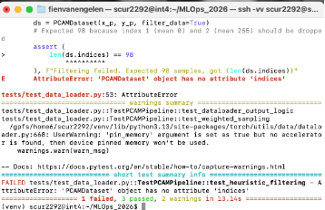
\!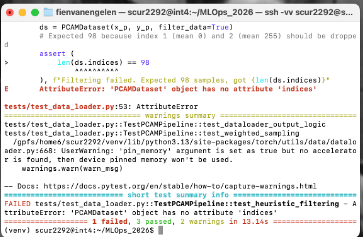

In eerste instantie faalden de tests omdat:

dependencies zoals h5py, pillow en mpmath ontbraken

filter_data en indices nog niet waren geïmplementeerd

Na het installeren van de ontbrekende packages en het toevoegen van heuristische filtering (verwijderen van volledig zwarte en volledig witte patches) en een expliciete self.indices array, slaagden de tests.

\!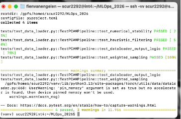


### (3) CI versus lokaal testen

In mijn GitHub-repository draait GitHub Actions dezelfde tests. Het is mogelijk dat CI faalt terwijl lokale tests slagen, omdat:

CI geen toegang heeft tot de PCAM-data op Snellius

CI in een CPU-only omgeving draait

sommige dependencies lokaal geïnstalleerd zijn maar niet in CI

Dit is een realistisch MLOps-probleem: CI onthult verborgen aannames over data, paden en dependencies.
\!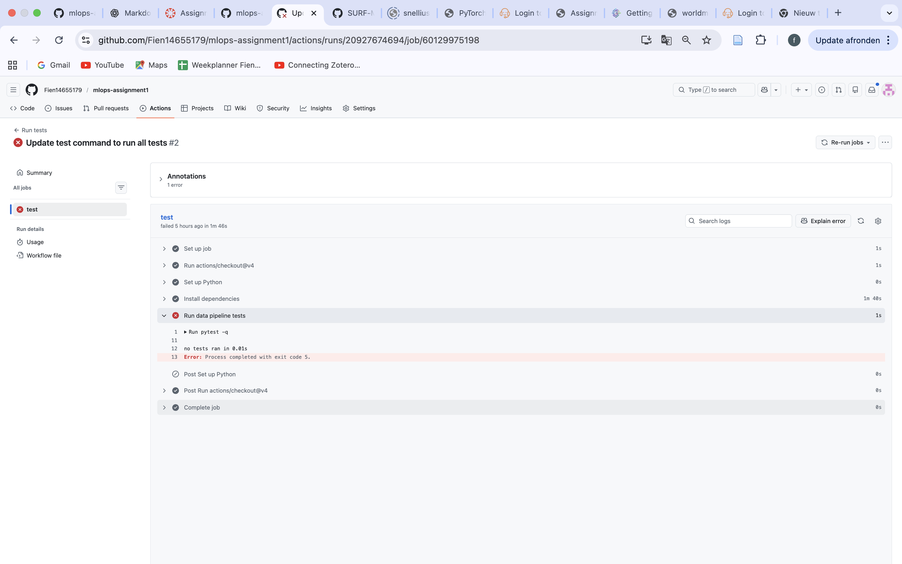

### (4) Class-imbalance en WeightedRandomSampler

De PCAM-dataset is sterk scheef verdeeld: er zijn veel meer negatieve (class 0) dan positieve (class 1) samples.

Zonder sampler bevat een batch van 32 voorbeelden meestal maar een paar positieve samples.
Met een WeightedRandomSampler wordt elke class ongeveer even vaak getrokken, waardoor een batch van 32 gemiddeld rond de 16 positieve en 16 negatieve samples bevat. Dit zorgt voor stabielere en eerlijkere training.

### (5) Exploratory Data Analysis (EDA)

Ik heb enkele EDA-plots gemaakt om de dataset beter te begrijpen:

Random samples van patches om te controleren of de beelden correct worden ingelezen en genormaliseerd

Een plot van de class-verdeling om de imbalance zichtbaar te maken

Controle op extreme waarden en outliers

Deze analyse bevestigde dat:

de data correct wordt geladen

de waarden binnen een veilige range liggen na clipping

de dataset sterk imbalanced is
\!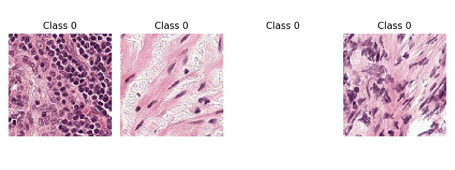
\!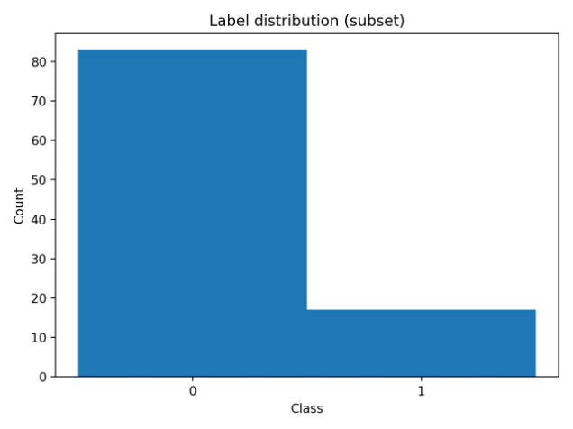
\!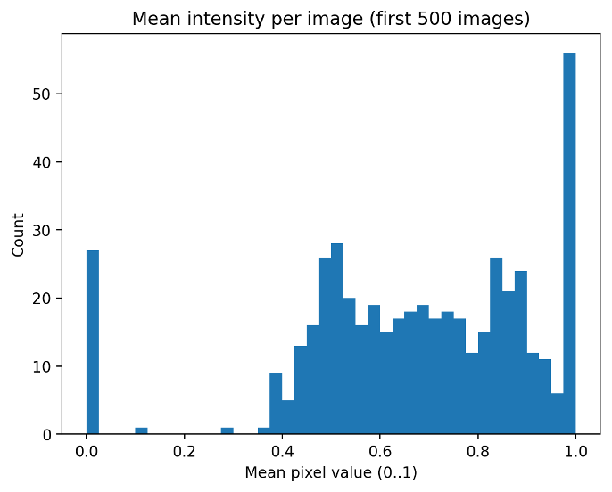
\!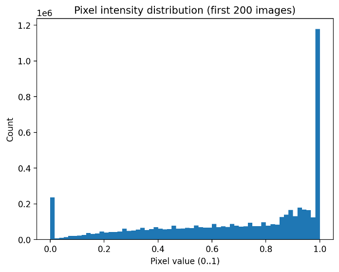
### 

## Question 8 — Model Implementation (MLP)
1) Als je _forward_pass eerst faalde: wat was de error en hoe bepaal je de input-dimensie?

Mijn _forward_pass faalde in het begin omdat de shape van de input niet overeenkwam met wat de eerste Linear laag verwachtte. De fout die je dan typisch krijgt is een shape mismatch (bijv. “mat1 and mat2 shapes cannot be multiplied” of een mismatch tussen het aantal features).

Om de juiste input-dimensie voor de eerste linear layer te bepalen, heb ik gekeken naar de inputshape van één sample:

Input: (3, 96, 96)

Aantal features na flattening: 3 * 96 * 96 = 27648

Dus de eerste laag moet iets hebben zoals:

nn.Linear(27648, hidden_dim)


en in de forward:

x = x.view(x.size(0), -1)  # (B, 3, 96, 96) -> (B, 27648)


Ik heb dit gecontroleerd door:

de inputshape te inspecteren (via tests en/of print(x.shape) tijdens debuggen)

expliciet de flattening correct te doen met behoud van de batch-dimensie (B)

### 2) Waarom checkt test_backprop expliciet dat weights updaten (en niet alleen dat loss een getal is)?

Alleen controleren dat de loss “een getal” is, is niet genoeg, omdat je dan nog steeds een silent failure kunt hebben, zoals:

er wordt geen loss.backward() gedaan

de optimizer wordt niet aangeroepen (optimizer.step() ontbreekt)

parameters staan op requires_grad=False

het model zit per ongeluk in een pad waar geen gradients doorheen gaan

In die gevallen kan de loss wel netjes worden berekend (dus een getal), maar leert het model helemaal niets.
test_backprop is daarom belangrijk omdat het verifieert dat:

gradients worden berekend

optimizer-steps daadwerkelijk plaatsvinden

de gewichten na één stap echt veranderen

Dat is precies het soort bug dat je vóór een zware training job op Snellius wil vinden.

### 3) Output van succesvolle test_model_shapes.py run

Plak hieronder de output van jouw succesvolle run:

pytest tests/test_model_shapes.py


Output:

\!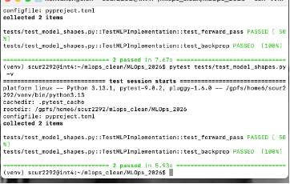

# Question 9

Ik heb vraag 9 proberen te maken, maar na veel pogingen is het niet gelukt. Hij crashte telkens. Ik hoop dit zo snel mogelijk nog te kunnen verbeteren in de werkgroepen. 

\!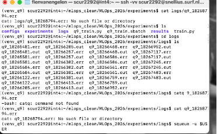

De log werkt wel. 

\!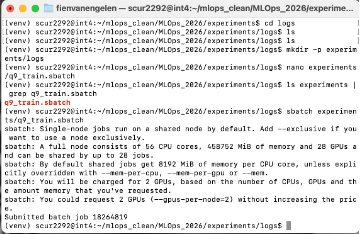
Vele batch jobs gemaakt. 

